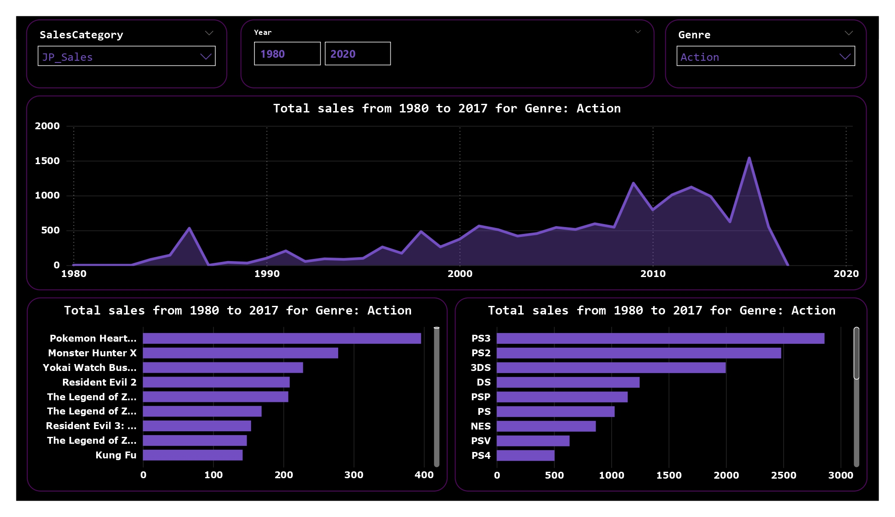

# VideoGamesSales
This interactive Power BI dashboard provides a comprehensive analysis of global video game sales, allowing users to explore key industry trends.
## Key Features:
✅ Global Sales – Analysis of total sales by platform, genre, and developer.
✅ Console Comparison – Evaluation of sales performance across different consoles and generations.
✅ Trends Over Time – Evolution of sales over the years to identify patterns and industry shifts.
✅ Top-Selling Games – List of the best-selling titles globally and by region.
✅ Geographic Analysis – Sales distribution across key markets such as America, Europe, and Asia.

This dashboard is an ideal tool for analysts, developers, and gaming enthusiasts looking to understand market dynamics and sales trends. 🎮📊
